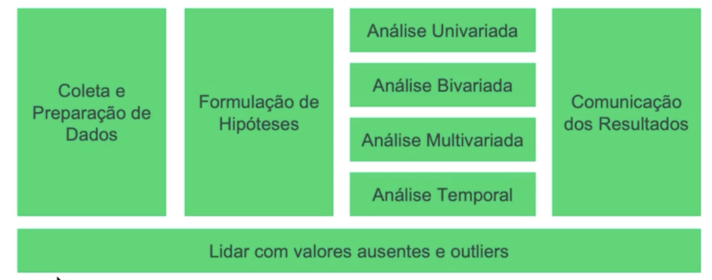

## EDA - Exploratory Data Analysis

EDA é um processo sistemático usado em projetos de ciência dedados para entender e resumir
as características fundamentais de um conjunto de dados.

Contexto do Problema - Segmento de Telecom

A empresa possui três conjuntos de dados de clientes e serviços, com uma variável que determina
se o cliente abandonou (churn) ou não a empresa de telecom.

O intuito é que com estes conjuntos de dados e com base em algumas hipóteses que iremos formular
e que serão respondidas pelo EDA, passa obter alguns insights iniciais para a construção de Inteligência Artificial que possa "prever" o abandono de clientes ainda ativos.